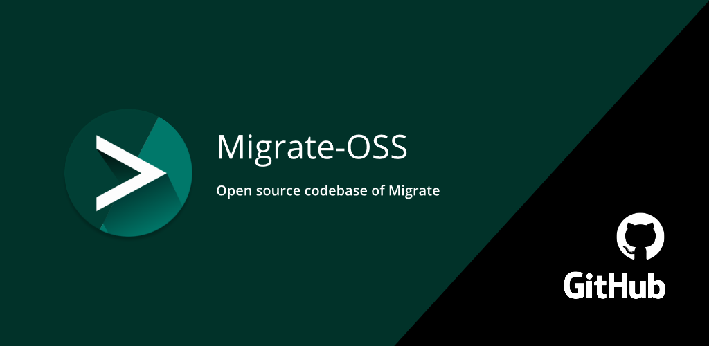

# Migrate - Data Backup



## Branch version
Version: 6.0.0 (Artemis)

## Screenshots

    

## Features

- Backup and restore
   - Call log history
   - SMS
   - Contacts

## Planned features

- Backup calender entries
- Possible support for password protection
- Root based features - using magisk or ADB root on custom ROMs
   - App backup
   - Some system features backup

## Compilation guide
1. Clone the three repositories.
   ```
   git clone https://github.com/BaltiApps/Migrate-OSS.git
   ```
2. Open `Migrate-OSS` project in Android Studio. Then compile and run (`Shift+F10` in most cases).

### Links

[Privacy Policy](privacy_policy.md)

[Telegram group link](https://t.me/migrateApp)  
[XDA thread Link](https://forum.xda-developers.com/t/app-root-5-0-1st-nov-2020-migrate-custom-rom-migration-tool.3862763/)  
[Official Google Play Store download](https://play.google.com/store/apps/details?id=balti.migrate)  
[Older versions on AndroidFileHost](https://www.androidfilehost.com/?w=files&flid=285270)  
